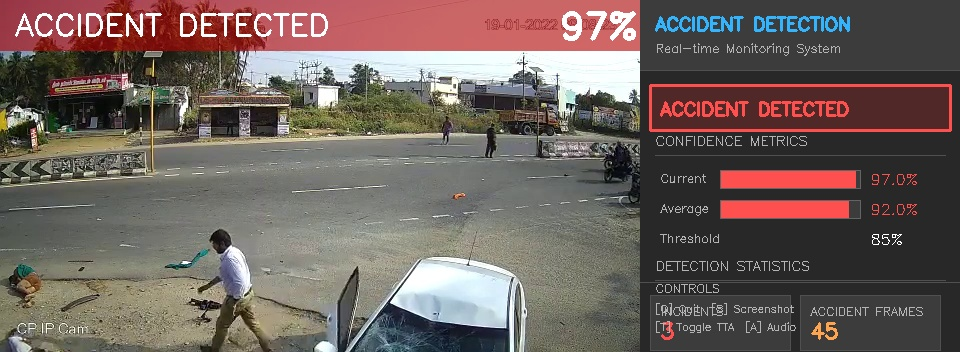

#  Real-Time Road Accident Detection System

[](https://www.python.org/)
[](https://pytorch.org/)
[](https://developer.nvidia.com/cuda-toolkit)
[](LICENSE)
[](#results)

A deep learning-based real-time accident detection system using **MobileNetV2** with PyTorch. The system analyzes video feeds (CCTV, dashcam, webcam) and automatically detects accidents, sends email alerts with screenshots to safety authorities.



---

##  Table of Contents

- [Features](#-features)
- [Demo Screenshots](#-demo-screenshots)
- [System Architecture](#-system-architecture)
- [Results](#-results)
- [Installation](#-installation)
- [Usage](#-usage)
- [Project Structure](#-project-structure)
- [Methodology](#-methodology)
- [Limitations](#-limitations)
- [Future Work](#-future-work)
- [Authors](#-authors)
- [License](#-license)

---

##  Features

| Feature | Description |
|---------|-------------|
|  **High Accuracy** | 99.80% test accuracy on 1,986 images |
|  **Real-time Detection** | 25+ FPS on GPU (RTX 4060) |
|  **Email Alerts** | Automatic alerts with accident screenshots |
|  **Professional Dashboard** | Side panel with real-time metrics |
|  **TTA (Test-Time Augmentation)** | Improved prediction reliability |
|  **Temporal Smoothing** | Reduces false positives using frame history |
|  **Auto Screenshots** | Captures incident frames for evidence |
|  **Audio Alerts** | Optional beep on accident detection |
|  **Logging** | Detection logs for analysis |

---

##  Demo Screenshots

### Accident Detection Examples

<table>
<tr>
<td></td>
<td></td>
</tr>
<tr>
<td align="center"><b>Vehicle Collision Detected</b></td>
<td align="center"><b>Multi-vehicle Accident</b></td>
</tr>
<tr>
<td></td>
<td></td>
</tr>
<tr>
<td align="center"><b>Crash Impact Frame</b></td>
<td align="center"><b>Post-collision Scene</b></td>
</tr>
</table>

### Dashboard Interface

The system provides a professional real-time dashboard showing:
- **Status Banner**: Color-coded alert ( Normal /  Possible /  Accident)
- **Confidence Metrics**: Current and average detection confidence
- **Detection Statistics**: Incident count, accident frames, rate
- **Temporal Analysis**: Visual window of recent frame predictions
- **System Info**: FPS, progress, settings


---

##  System Architecture

```

                     ACCIDENT DETECTION PIPELINE                          

                                                                          
                
     Video    Frame         MobileNetV2  Temporal   
     Input        Preprocessing     + Classifier     Smoothing  
                
                                                                       
                        
                                                                        
                     
              Incident      Email        Safety          
              Detection         Alert            Authorities     
                     
                                                                        
                                                                        
                                         
        Dashboard Display                                              
      Status  Metrics  Stats                                        
                                         
                                                                          
-
```

### Model Architecture

```
MobileNetV2 Backbone (Pre-trained on ImageNet)
    
    
Global Average Pooling
    
    

     Custom Classification Head      

  Dropout(0.5)                       
  Linear(1280  512) + BN + ReLU     
  Dropout(0.4)                       
  Linear(512  256) + BN + ReLU      
  Dropout(0.3)                       
  Linear(256  128) + BN + ReLU      
  Dropout(0.2)                       
  Linear(128  1) + Sigmoid          

    
    
Binary Output: P(Accident)
```

---

##  Results

### Training Performance

| Phase | Epochs | Best Val Accuracy | Description |
|-------|--------|-------------------|-------------|
| Phase 1 | 10 | 99.85% | Frozen backbone, train classifier |
| Phase 2 | 10 | 99.95% | Fine-tune top 50 layers |
| Phase 3 | 10 | 100.00% | Full model fine-tuning |

### Test Set Metrics

| Metric | Value |
|--------|-------|
| **Test Accuracy** | 99.80% |
| **Precision** | 100.00% |
| **Recall** | 99.60% |
| **F1-Score** | 99.80% |
| **Specificity** | 100.00% |

### Confusion Matrix (Test Set)

```
                    Predicted
                    Accident    Normal
Actual Accident       989          4
Actual Normal           0        993
```

### Dataset Statistics

| Split | Accident | Normal | Total |
|-------|----------|--------|-------|
| Train | 4,629 | 4,629 | 9,258 |
| Validation | 992 | 992 | 1,984 |
| Test | 993 | 993 | 1,986 |
| **Total** | **6,614** | **6,614** | **13,228** |

---

##  Installation

### Prerequisites

- Python 3.10+
- NVIDIA GPU with CUDA support (recommended)
- 8GB+ RAM

### Setup

```bash
# Clone the repository
git clone https://github.com/arrya5/accident-detection-system.git
cd accident-detection-system

# Create virtual environment
python -m venv .venv

# Activate virtual environment
# Windows:
.venv\Scripts\activate
# Linux/Mac:
source .venv/bin/activate

# Install dependencies
pip install -r requirements.txt
```

### Requirements

```
torch>=2.0.0
torchvision>=0.15.0
opencv-python>=4.8.0
numpy>=1.24.0
Pillow>=9.5.0
tqdm>=4.65.0
scikit-learn>=1.3.0
matplotlib>=3.7.0
```

---

##  Usage

### 1. Real-time Video Detection

```bash
# Webcam
python src/detect_pytorch.py --source 0

# Video file
python src/detect_pytorch.py --source path/to/video.mp4

# Save output video
python src/detect_pytorch.py --source video.mp4 --output result.mp4

# Adjust threshold (default: 0.85)
python src/detect_pytorch.py --source video.mp4 --threshold 0.90
```

### 2. With Email Alerts

```bash
python src/detect_pytorch.py --source video.mp4 \
    --email \
    --sender-email "your.alert.email@gmail.com" \
    --sender-password "your-app-password" \
    --recipient-email "authority@example.com" \
    --camera-location "Highway Junction A - Camera 1"
```

### 3. Single Image Detection

```bash
python src/detect_pytorch.py --image accident.jpg --output result.jpg
```

### 4. Model Verification

```bash
# Verify model performance on test set
python src/verify_model_pytorch.py --data_path data --plot --export
```

### 5. Interactive Dataset Testing

```bash
# Visual testing with random samples
python src/test_dataset_pytorch.py --data_path data --samples 50

# Auto mode for presentations
python src/test_dataset_pytorch.py --data_path data --auto 500
```

### Command Line Arguments

| Argument | Description | Default |
|----------|-------------|---------|
| `--source` | Video file, webcam (0), or RTSP URL | Required |
| `--output` | Output video path | None |
| `--model` | Path to model file | Auto-detect |
| `--threshold` | Detection confidence threshold | 0.85 |
| `--no-display` | Disable live preview | False |
| `--no-tta` | Disable Test-Time Augmentation | False |
| `--audio` | Enable audio alerts | False |
| `--email` | Enable email alerts | False |
| `--log` | Enable detection logging | False |

---

##  Project Structure

```
accident-detection-system/
  assets/                    # Screenshots and images for README
    accident_detection_1.jpg
    accident_detection_2.jpg
    accident_detection_3.jpg
    accident_detection_4.jpg
    dashboard_demo.jpg
  data/                      # Dataset (not in repo)
    train/
       Accident/
       Non Accident/
    val/
    test/
  docs/                      # Documentation
    METHODOLOGY.md
    RESULTS.md
  models/                    # Trained models
    accident_detector_best.pth
  output/                    # Detection outputs
  src/                       # Source code
    train_pytorch.py          # Training script
    detect_pytorch.py         # Real-time detection
    verify_model_pytorch.py   # Model verification
    test_dataset_pytorch.py   # Interactive testing
    extract_frames.py         # Video frame extraction
    legacy/                   # TensorFlow (deprecated)
  requirements.txt           # Python dependencies
  LICENSE                    # MIT License
  README.md                  # This file
```

---

##  Methodology

### 1. Data Collection

- **Source**: Real-world accident footage from YouTube, CCTV archives
- **Frame Extraction**: 2 FPS with blur detection to filter low-quality frames
- **Balancing**: Equal samples of Accident and Non-Accident classes

### 2. Preprocessing

- Resize to 224224 pixels
- Normalize using ImageNet statistics
- Data augmentation: rotation, flip, brightness, contrast

### 3. Training Strategy

**3-Phase Progressive Fine-tuning:**

1. **Phase 1**: Freeze MobileNetV2 backbone, train only classifier
2. **Phase 2**: Unfreeze top 50 layers, fine-tune with lower LR
3. **Phase 3**: Full model fine-tuning with very low LR

### 4. Detection Pipeline

1. **Frame Capture**: Read frames from video source
2. **TTA**: Apply 5 augmented versions for robust prediction
3. **Temporal Smoothing**: Use 7-frame window, require 5/7 to confirm
4. **Incident Tracking**: Count distinct incidents, not just frames
5. **Alert System**: Save screenshot, send email on new incident

---

##  Limitations

| Limitation | Description |
|------------|-------------|
| **Chaotic Traffic** | Dense/erratic traffic (common in India) may trigger false positives |
| **Training Data Bias** | Model trained primarily on Western traffic patterns |
| **Lighting Conditions** | Performance may vary in extreme lighting (night, glare) |
| **Camera Angle** | Optimized for overhead/side CCTV views |
| **Occlusion** | Partially hidden accidents may not be detected |

---

##  Future Work

- [ ] Fine-tune on Indian traffic dataset
- [ ] Add object detection for vehicle tracking
- [ ] Implement motion-based pre-filtering
- [ ] Web dashboard for multi-camera monitoring
- [ ] Mobile app for dashcam integration
- [ ] Edge deployment (Jetson Nano, Raspberry Pi)

---

##  Authors

**Arya Bhardwaj**  
B.Tech Computer Science  
Minor Project - Accident Detection System

---

##  License

This project is licensed under the MIT License - see the [LICENSE](LICENSE) file for details.

---

##  Acknowledgments

- MobileNetV2 pre-trained weights from PyTorch/TorchVision
- Dataset curated from public CCTV and dashcam footage
- NVIDIA for CUDA support

---

<p align="center">
  <b> Star this repo if you find it useful! </b>
</p>
