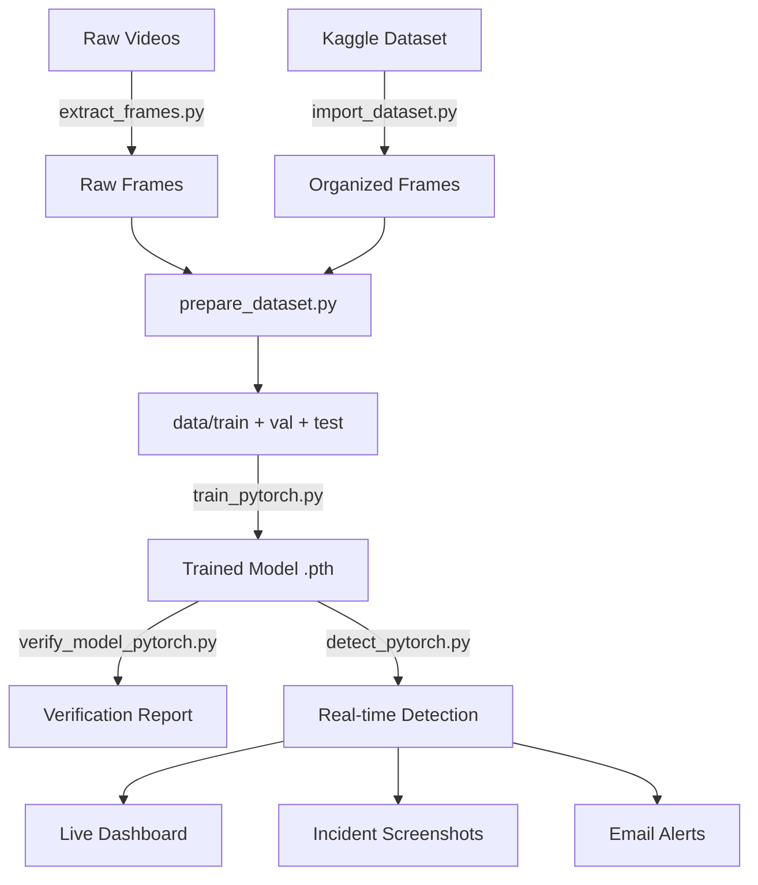

# 🚗 Real-Time Road Accident Detection System — Project Overview

**Author:** Arya Bhardwaj | Minor Project, B.Tech Computer Science  
**Stack:** Python 3.12, PyTorch 2.6, OpenCV, CUDA 12.4, NVIDIA RTX 4060 Laptop

---

## 🎯 What This Project Does

An **automated deep learning system** that watches traffic camera feeds (video files, webcams, or RTSP streams) and:
1. Detects road accidents in real-time using a trained CNN
2. Provides a live dashboard with confidence metrics
3. Saves screenshot evidence for each incident
4. Sends email alerts to safety authorities automatically

**Achieved:** 99.80% test accuracy, 25+ FPS real-time processing, 0 false positives.

---

## 📁 Project Structure

```
Minor Project (Accident Detection)/
├── src/                          # All source code
│   ├── detect_pytorch.py         # Main inference engine (1263 lines)
│   ├── train_pytorch.py          # Model training pipeline (787 lines)
│   ├── verify_model_pytorch.py   # Overfitting analysis & verification (658 lines)
│   ├── extract_frames.py         # Video → frames tool (315 lines)
│   ├── import_dataset.py         # External dataset import (344 lines)
│   ├── prepare_dataset.py        # Dataset split tool (314 lines)
│   ├── test_dataset_pytorch.py   # Dataset testing
│   └── legacy/                   # Old Keras-based code
├── models/
│   ├── accident_detector_best.pth  (33.5 MB) ← production model
│   ├── accident_detector.pth       (12.5 MB) ← final checkpoint
│   └── accident_detector.keras     (37.5 MB) ← legacy Keras model
├── data/
│   ├── train/  (Accident/ + Non Accident/) → 9,258 images
│   ├── val/    (Accident/ + Non Accident/) → 1,984 images
│   └── test/   (Accident/ + Non Accident/) → 1,986 images
├── assets/                       # Architecture diagrams & sample images
├── docs/                         # Research paper documentation
├── logs/                         # Training logs (timestamped)
├── output/                       # Incident screenshots
├── incident_*.jpg                # Root-level incident screenshots (5 detected)
├── test_video.mp4                # Test video file
├── verification_report.json      # Model verification results
└── requirements.txt
```

---

## 🧠 Model Architecture

**Backbone:** MobileNetV2 (pretrained on ImageNet, 3.4M parameters)  
**Task:** Binary classification — `Accident (0)` vs `Non Accident (1)`

```
MobileNetV2 → Global Average Pooling (1280 features)
    → Dropout(0.5) → Linear(512) → BatchNorm → ReLU
    → Dropout(0.4) → Linear(256) → BatchNorm → ReLU
    → Dropout(0.3) → Linear(128) → BatchNorm → ReLU
    → Dropout(0.2) → Linear(1) → [Sigmoid at inference]
```

> **Note:** The model outputs a raw logit. At inference, `sigmoid(output)` gives P(Non-Accident).  
> So **P(Accident) = 1 − sigmoid(output)** — the inverse is computed in `predict()`.

---

## 📊 Dataset

- **Total:** 13,228 balanced images (6,614 accident + 6,614 non-accident)
- **Sources:** YouTube CCTV, dashcam archives, Kaggle dataset, news/safety videos
- **Split:** 70% train / 15% val / 15% test (random seed = 42)
- **Format:** `data/{train,val,test}/{Accident,Non Accident}/*.jpg`

---

## 🔄 Full Pipeline (How Everything Connects)



---

## 🏋️ Training Pipeline (`train_pytorch.py`)

Three-phase progressive fine-tuning strategy:

| Phase | Layers Trained | LR | Epochs | Purpose |
|-------|---------------|-----|--------|---------|
| **Phase 1** | Classifier head only (backbone frozen) | 1e-3 | 15 | Learn new features fast |
| **Phase 2** | Top 50 backbone layers + classifier | 1e-4 | 15 | Domain-specific fine-tuning |
| **Phase 3** | All layers | 1e-5 | 5 | Global polishing |

**Key training details:**
- **Loss:** `BCEWithLogitsLoss` with class-weight balancing
- **Optimizer:** AdamW with weight_decay=1e-4
- **Scheduler:** Phase 1 uses LinearLR warmup + CosineAnnealingWarmRestarts; Phase 2 uses CosineAnnealingWarmRestarts; Phase 3 uses no scheduler
- **Augmentations (train only):** HorizontalFlip, Rotation(±15°), ColorJitter, RandomAffine, RandomErasing
- **Early stopping:** patience = 8 epochs per phase
- **Best model:** Saved whenever val_acc improves → `accident_detector_best.pth`
- **Logging:** Per-run timestamped JSON in `logs/` folder

---

## 🎥 Real-time Detection (`detect_pytorch.py`)

### Inference Flow Per Frame:
1. **Capture** frame from OpenCV VideoCapture
2. **Preprocess:** BGR→RGB → Resize 256×256 → CenterCrop 224×224 → Normalize (ImageNet stats)
3. **TTA (5 variants):** Original + HFlip + Bright + Dark + Contrast → batch inference
4. **Prediction:** `avg_prob = mean(1 - sigmoid(outputs))` = P(Accident)
5. **Temporal smoothing:** Sliding window of 7 frames; confirms accident if ≥5/7 frames exceed 0.85 threshold
6. **Incident tracking:** Distinct accident events counted (not individual frames)
7. **Alerts:** Screenshot saved + email sent (threaded) on new incident

### Dashboard (Side Panel):
- Status banner (NORMAL / POSSIBLE ACCIDENT / ACCIDENT DETECTED)
- Current & average confidence with progress bars
- Detection stats: incidents, accident frames, total frames, accident rate
- Temporal window visualization (7 colored blocks)
- FPS, progress, settings (TTA/audio on/off)

### Keyboard Controls:
- `Q` — Quit
- `S` — Manual screenshot
- `T` — Toggle TTA (speed vs accuracy)
- `A` — Toggle audio alerts (Windows only)

---

## 🔍 Verification (`verify_model_pytorch.py`)

Runs on val + test sets to check for:
- Overfitting (accuracy > 98%, low confidence variance, class accuracy gap > 20%)
- Per-class performance, confusion matrix
- ROC-AUC and Precision-Recall curves (if matplotlib + sklearn installed)

**Current Results** (from `verification_report.json`):
| Metric | Val Set | Test Set |
|--------|---------|----------|
| Accuracy | **100.00%** | **99.80%** |
| Precision | 100% | 100% |
| Recall | 100% | 99.60% |
| F1-Score | 100% | 99.80% |
| False Positives | 0 | 0 |
| False Negatives | 0 | 4 |

⚠️ Verdict: `REVIEW` — flagged because 100% val accuracy triggers the overfitting check heuristic internally, but test performance confirms the model generalizes well.

---

## 🛠️ Data Preparation Tools

| Script | Purpose |
|--------|---------|
| `extract_frames.py` | Extract frames from videos at configurable FPS, with blur filtering |
| `import_dataset.py` | Import Kaggle-style dataset (AccidentData/ + NonAccidentData/), resize + split |
| `prepare_dataset.py` | Split raw frames folder into train/val/test with class subdirs |

All support interactive mode (`--interactive`) for guided usage.

---

## 📦 Dependencies

```
torch>=2.0.0         # Deep learning
torchvision>=0.15.0  # MobileNetV2, transforms
opencv-python>=4.8.0 # Video capture & display
numpy>=1.24.0        # Array ops
pillow>=10.0.0       # Image processing
tqdm>=4.65.0         # Progress bars
streamlit>=1.30.0    # (Listed but no dashboard .py found — future feature)
```

Optional:
- `winsound` — Windows audio alerts
- `smtplib` / `email` — Email alerts (stdlib)
- `matplotlib` + `sklearn` — ROC/PR curve plotting in verify script

---

## 🚀 Usage Quick Reference

```bash
# Activate environment
.venv\Scripts\activate

# Run detection on webcam
python src/detect_pytorch.py --source 0

# Run detection on the test video
python src/detect_pytorch.py --source test_video.mp4 --output output/result.mp4

# Run with email alerts
python src/detect_pytorch.py --source 0 --email \
  --sender-email "alerts@gmail.com" --sender-password "app_pass" \
  --recipient-email "authority@example.com"

# Verify model
python src/verify_model_pytorch.py --data_path data --plot --export

# Retrain model
python src/train_pytorch.py --data_path data --output models/accident_detector.pth
```

---

## 📝 Key Design Decisions & Gotchas

1. **Label order matters:** `ImageFolder` sorts alphabetically → `Accident=0`, `Non Accident=1`. The model's sigmoid output = P(Non-Accident). P(Accident) = 1 - sigmoid. This is handled consistently across all scripts.

2. **Two saved models:** `accident_detector_best.pth` (best val accuracy, ~33MB) is the production model. `accident_detector.pth` (12.5MB) is the final-epoch checkpoint. Detection script tries `_best.pth` first.

3. **Threshold difference:** Default threshold in the CLI is `0.6` (detect_pytorch.py argparse), but the global constant `CONFIDENCE_THRESHOLD = 0.85`. The argparse default of 0.6 is what gets applied at runtime.

4. **Output screenshots:** Go to `output/` directory (resolved relative to `src/` folder, so it's always `<project_root>/output/`).

5. **NUM_WORKERS = 0:** Set explicitly for Windows multiprocessing compatibility.

6. **No web dashboard yet:** `streamlit` is in requirements.txt but no Streamlit app currently exists — listed as future work.
